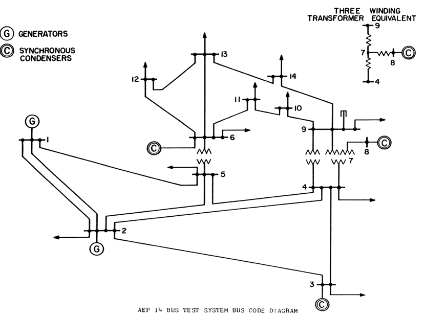
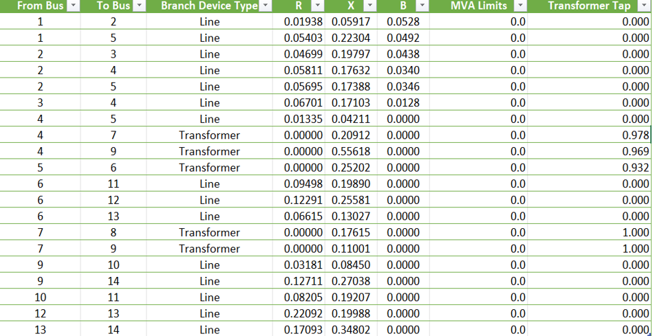
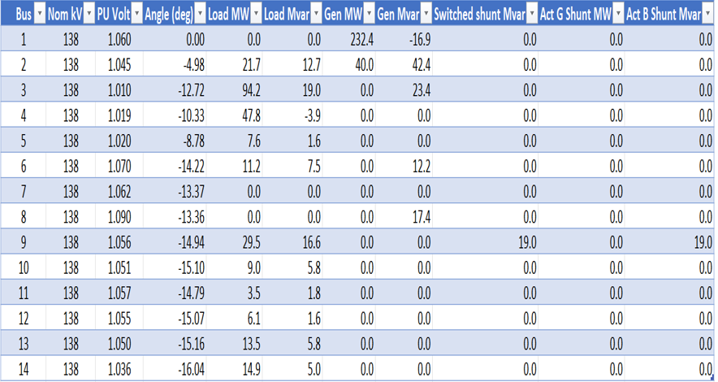
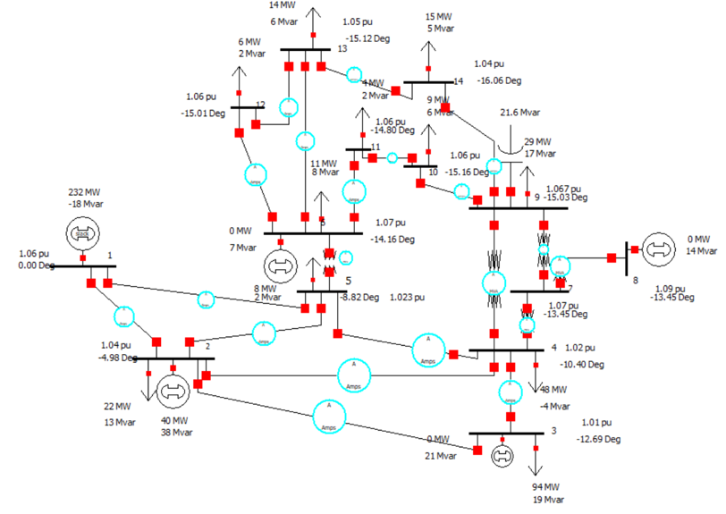
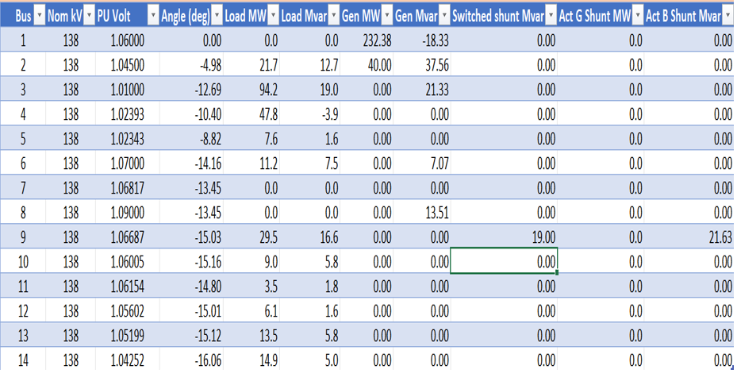
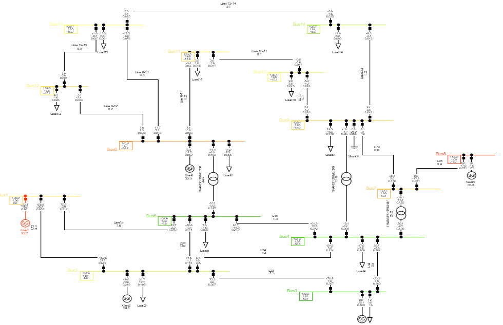
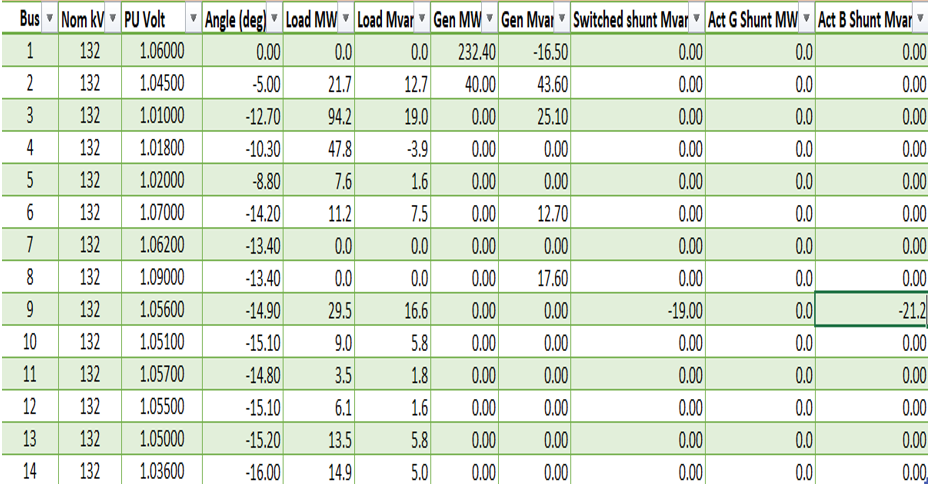
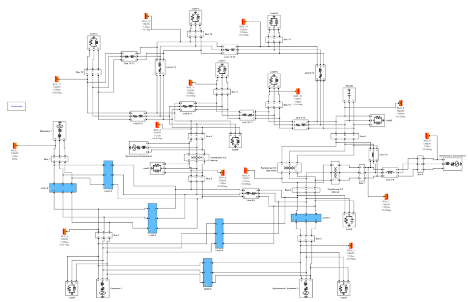
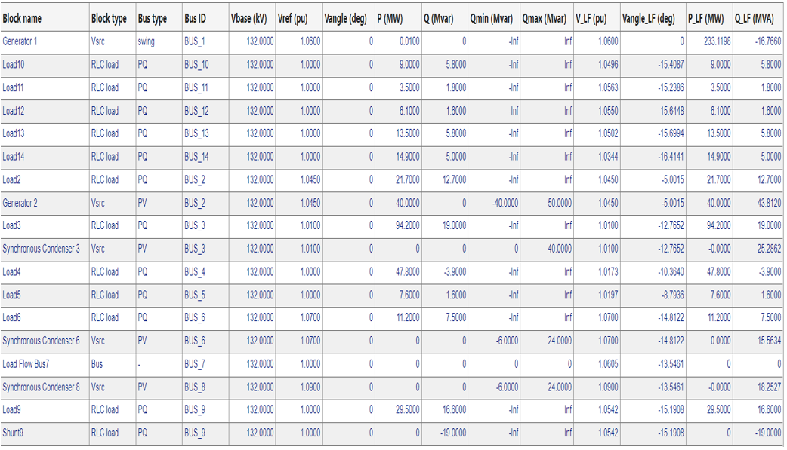

# IEEE 14-Bus Power System Modelling and Validation (Multi-Software)

## Overview
This project presents the modelling and power flow analysis of the IEEE 14-bus test system across three software environments:

- PowerWorld Simulator  
- DIgSILENT PowerFactory  
- MATLAB Simulink  

The results from each platform are compared with benchmark system data to evaluate accuracy and modelling consistency.

---

## Objective
- Model the IEEE 14-bus system in multiple simulation environments  
- Perform power flow analysis using each platform  
- Validate simulation results against known system data  
- Compare modelling accuracy across tools  

---

## Reference System

### IEEE 14-Bus Network

Standard IEEE 14-bus system used as the reference model.

---

### Branch Data

Defines transmission line parameters and system topology.

---

### Benchmark System Results

Reference results used to validate all simulations.

---

## PowerWorld Simulation

### Model Implementation

- Network recreated using PowerWorld Simulator  
- Includes buses, generators, loads, and transformers  
- Newton-Raphson power flow used  

---

### Simulation Results

- Voltage magnitudes match within **0.007 pu**  
- Voltage angles match within **0.1°**  

✔ Results closely align with benchmark data  
✔ Minor differences due to modelling approximations  

---

## DIgSILENT PowerFactory Simulation

### Model Implementation

- System modelled using PowerFactory components  
- Includes detailed representation of:
  - Lines  
  - Transformers  
  - Loads  
  - Generators  

---

### Simulation Results

- Voltage magnitude error ≤ **0.001 pu**  
- Voltage angle error ≤ **0.04°**  

✔ Highest accuracy among the three platforms  
✔ Validates PowerFactory’s modelling precision  

---

## MATLAB Simulink Simulation

### Model Implementation

- Built using Simulink power system components:
  - Three-phase sources  
  - RLC branches  
  - Transformers  
  - Measurement blocks  

---

### Simulation Results

- Voltage magnitude error ≤ **0.017 pu**  
- Voltage angle error ≤ **0.592°**  

✔ Results closely match benchmark values  
✔ Slightly larger deviations due to modelling approximations  

---

## Comparison of Results

| Software        | Voltage Error (pu) | Angle Error (°) |
|----------------|------------------|----------------|
| PowerWorld     | ≤ 0.007          | ≤ 0.1          |
| PowerFactory   | ≤ 0.001          | ≤ 0.04         |
| Simulink       | ≤ 0.017          | ≤ 0.592        |

---

## Key Insights

- All three platforms successfully replicate the IEEE 14-bus system  
- PowerFactory provides the highest accuracy  
- PowerWorld offers efficient and intuitive modeling  
- Simulink provides flexibility for dynamic and control-based simulations  
- Differences arise due to:
  - Modelling assumptions  
  - Numerical methods  
  - Component approximations  

---

## Tools Used

- PowerWorld Simulator  
- DIgSILENT PowerFactory  
- MATLAB Simulink  

---

## Files

- PowerWorld_IEEE14Bus_Model_and_Report.zip  
- PowerFactory_IEEE14Bus_Model_and_Report.zip  
- Simulink_IEEE14Bus_Model_and_Report.zip  

---

## Conclusion

This project demonstrates that multiple simulation platforms can accurately model and analyze power systems. While minor discrepancies exist, all tools provide reliable results. The comparison highlights the strengths of each platform and validates their use for power flow studies and system analysis.

---

## Author

Royalty Holyworth Chihava
